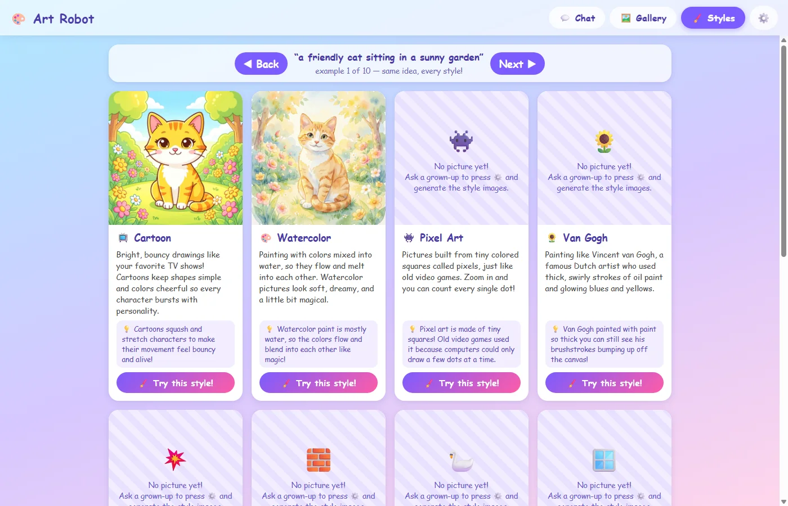

# 🎨 Kids AI Art Generator

A tiny local web app where a kid types what they want to see, picks an art style,
and a local [ComfyUI](https://github.com/comfyanonymous/ComfyUI) instance generates
the image on your own GPU. No accounts, no subscriptions, no usage limits, and
nothing leaves your machine.

It doubles as a way for children to learn about art styles: a Styles page shows
every style with a kid-friendly description, a fun fact, and example images —
all generated from the *same* fixed prompts, so kids can flip through and see how
"a friendly cat sitting in a sunny garden" looks as a cartoon, a watercolor,
pixel art, claymation, or a Van Gogh painting.


## Features

- **Chat interface** — type a prompt, optionally pick a style card, press Create.
  A 🎲 Surprise button fills in a random prompt and style; every result has a
  "Make another!" button that reruns the prompt with a new seed, and shows how
  long the image took to generate.
- **Styles learning page** — each of the 12 styles has a description written for
  kids, a fun fact, and example images. Back/Next buttons switch *all* cards to
  the next fixed example prompt at once so styles can be compared side by side.
  A "Try this style!" button jumps back to the chat with that style selected.
- **Gallery** — everything ever generated (the kid's own pictures and the style
  examples), newest first.
- **Grown-up settings** — a ⚙️ dialog bulk-generates the style example images
  (12 styles × 10 example prompts = 120 images), one at a time with a progress
  bar. It's resumable: it only ever generates the missing ones.
- **Kid-safe by construction** — a fixed negative prompt (gore, weapons, nsfw,
  scary…) is baked into every request server-side, where the kids can't turn
  it off. Everything is stored locally: SQLite + an `images/` folder.



## Requirements

- Python 3.10+
- [ComfyUI](https://github.com/comfyanonymous/ComfyUI) running locally on
  `http://127.0.0.1:8188` with at least one model installed

The app asks ComfyUI what models it has and picks automatically:

- a regular **checkpoint** if one exists (SDXL/Flux checkpoints render at
  1024px, others at 512px), otherwise
- a **Flux 2** workflow assembled from separate diffusion model / text encoder
  / VAE loaders.

No model configuration needed.

## Run it

```
pip install -r requirements.txt
python app.py
```

Then open http://127.0.0.1:8777

To fill in the Styles page, press the ⚙️ gear icon and click **Generate Style
Images**. This takes a while (about 2m 40s per image for Flux 2 at 1024px on my
machine — roughly 5 hours for the full set of 120), but you can stop any time
and it picks up where it left off. Keep the tab open while it runs.


## Customizing

- **Styles** live in [`styles.json`](styles.json) — name, emoji, prompt suffix,
  kid-level description, and fun fact. Adding a style is a JSON edit; the app
  picks it up on restart.
- **Example prompts** for the Styles page are the `EXAMPLE_PROMPTS` list at the
  top of `app.py`.
- **The safety negative prompt** is `NEGATIVE_PROMPT` in `app.py`.
- **ComfyUI address** is `COMFY_URL` in `app.py` if yours isn't on the default
  port.

## How it works

- `app.py` — single-file FastAPI backend. Builds a text-to-image ComfyUI
  workflow, submits it to `/prompt`, polls `/history`, downloads the result
  from `/view`, and saves it to `images/` with a row in `chat.db` (created
  automatically, including the generation time).
- `static/index.html` — the whole frontend in one file: chat bubbles, style
  cards, a wavy particle loading animation, the Styles learning page, gallery,
  lightbox, and the settings dialog. Vanilla JS, no build step.

## License

[MIT](LICENSE)
